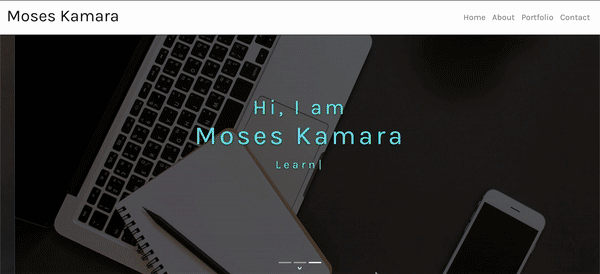

## Badges

## Description
React Portfolio that show cases all of my skills that I have learned in the program to bring me to closer to being Employer Competitive. This will be used as a showcase to future employers of what am capable of and the possibilities are endless with creativity and functionality.

## Table of Contents
* [Description](#description)
* [Installation](#installation)
* [Usage](#usage)
* [Technologies](#technologies)
* [Contributing](#contributing)
* [Test](#test)
* [Challenges](#challenges)
* [Questions](#questions)
* [License](#license)
* [Author](#Author)
* [Badges](#badges)

## Installation
Before installing this application on yopur local computer, ensure that you have Node installed. This application works in Node. You can go to the following website to download Node: <a href='https://nodejs.org/en/'>Node</a>

    1. Clone the Git repository
        $ git clone <repo>
    2. Navigate to the directory and install the dependencies
        $ npm install

## Usage
    1. Once all dependencies have been install. Run npm script npm run start to launch the app

    2. You should be able to use the links to move around the app with no issues

    3. If there are any issues please refer to the hints or guide provided by react

## Technologies
   - Node.js
   - Node Packages (react, react-bootstrap, styled-components, react-script,typewriter-effects etc)
   - GH-Pages
   - @merc/react-timeline

## Contributing
If you would like to contribute to this project please reach out to me on Github or email.

## Test
There are no automatic test designed for this application. I ran manual test to make sure everything was working the way it should.

## Challenges
Working with the different packages and components was difficult. Trying to figure out the best one that will achieve the vision that I had was one that required most of my time. I soent most of my time doing research into how to make things work and import and used them in the application. 

## Questions
If you have questions about this repository? Please contact me at [kamara.moses@yahoo.com](mailto:kamara.moses@yahoo.com). View more of my work in GitHub at [kamara-moses](https://github.com/kamara-moses).

## License
This repository is licensed under the MIT license.

Copyright (c) [2020] [Moses Kamara]

Permission is hereby granted, free of charge, to any person obtaining a copy of this software and associated documentation files (the 'Software'), to deal in the Software without restriction, including without limitation the rights to use, copy, modify, merge, publish, distribute, sublicense, and/or sell copies of the Software, and to permit persons to whom the Software is furnished to do so, subject to the following conditions:

The above copyright notice and this permission notice shall be included in all copies or substantial portions of the Software.

THE SOFTWARE IS PROVIDED 'AS IS', WITHOUT WARRANTY OF ANY KIND, EXPRESS OR IMPLIED, INCLUDING BUT NOT LIMITED TO THE WARRANTIES OF MERCHANTABILITY, FITNESS FOR A PARTICULAR PURPOSE AND NONINFRINGEMENT. IN NO EVENT SHALL THE AUTHORS OR COPYRIGHT HOLDERS BE LIABLE FOR ANY CLAIM, DAMAGES OR OTHER LIABILITY, WHETHER IN AN ACTION OF CONTRACT, TORT OR OTHERWISE, ARISING FROM, OUT OF OR IN CONNECTION WITH THE SOFTWARE OR THE USE OR OTHER DEALINGS IN THE SOFTWARE.

## Author
